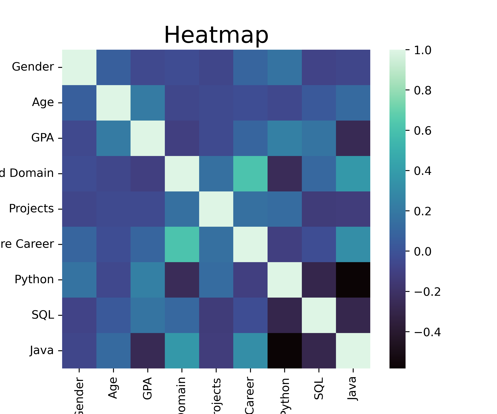
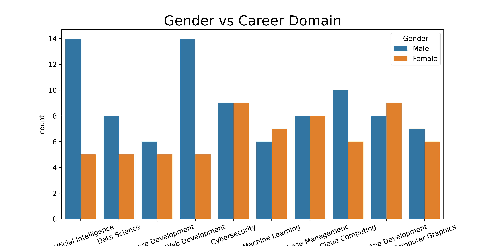
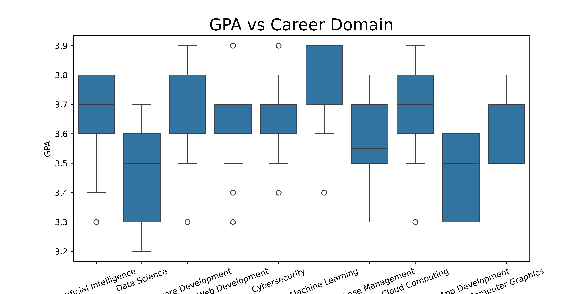

#  Career Domain Predictor (Machine Learning Project)

This project is a Machine Learning-based application that predicts a student's **most suitable tech domain** based on their academic background, skills, and interests.

It also includes *Data Analysis Visualizations** using Matplotlib and Seaborn to understand patterns in the dataset.

---

##  Project Overview

The model predicts the **Interested Domain** such as:
- Artificial Intelligence
- Web Development
- Cybersecurity
- Data Science
- Cloud Computing
- Mobile App Development

Based on inputs like:
- Gender
- Age
- GPA
- Major
- Interested Projects
- Python, SQL, Java skills

---

##  Machine Learning Model

- Algorithm Used: **Decision Tree Classifier**
- Library: Scikit-learn
- Data Preprocessing: One-Hot Encoding (pd.get_dummies)
- Model Evaluation: Accuracy Score

 Final Accuracy: 93.55 %

---

##  Data Visualizations

The following visualizations were created using **Matplotlib & Seaborn**:

### 1. Feature Correlation Heatmap
Shows correlation between numerical features.



---

### 2. Gender vs Interested Domain
Displays distribution of domains based on gender.



---

### 3. GPA vs Interested Domain
Shows how academic performance influences domain choice.



---

### 4. Skill Distributions vs Domain
Analyzes Python, SQL and Java proficiencies vs career preference.

##  Project Structure
```
career-domain-predictor/
│
├── careers.csv
├── model-training.ipynb
├── model-visuals.ipynb
├── predictor.py
├── career-predictor-model.joblib
├── columns.joblib
│
├── images/
│ ├── heatmap.png
│ ├── gender_vs_domain.png
│ ├── gpa_vs_domain.png
│ ├── python_vs_domain.png
│ ├── sql_vs_domain.png
│ └── java_vs_domain.png
│
└── README.md
```

##  How to Run the Project

### 1. Install dependencies
```bash
pip install pandas numpy scikit-learn matplotlib seaborn joblib
```
### 2. Train the model
```
python train_model.py
```
### 3. Run predictions
```
python predictor.py
```
## Technologies Used
  Python 
  Pandas
  NumPy
  Scikit-learn
  Matplotlib
  Seaborn
  Joblib

## Key Insights from Data
  Students with higher GPA tend to prefer AI/Data Science domains
  Python skill strongly correlates with AI & Data Science interest
  Web Development is common across all majors
  SQL & Java skills show stronger association with backend domains
 
## Future Improvements
  Add Random Forest / XGBoost for better accuracy
  Build a web interface using Streamlit
  Add recommendation explanations (why a domain was predicted)
  Deploy model online

 ## Author
@kanushri_s20

Made as a first Machine Learning project to understand:

Data preprocessing
Model training
Prediction pipeline
Data visualization


---


